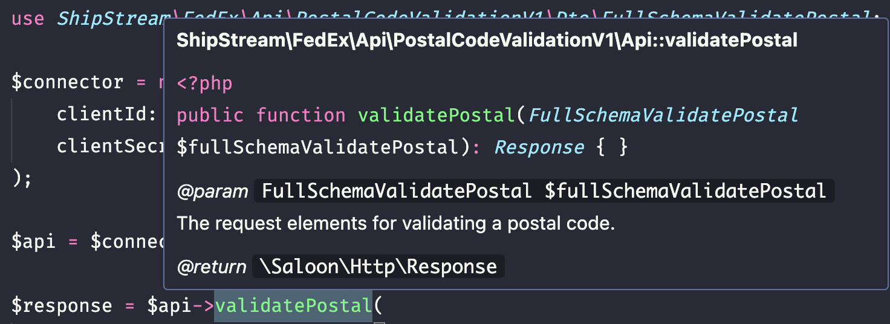

FedEx SDK for PHP
----

This is a PHP SDK for working with [FedEx's REST APIs](https://developer.fedex.com/api/en-us/catalog.html). The SDK is autogenerated from FedEx's OpenAPI models (with substantial model refactoring) and built on top of [Saloon](https://docs.saloon.dev/).

> [!WARNING]
> This SDK has not yet been used in production, and is still very much in beta. There may very well be bugs that we haven't found yet. If you find any problems, we'd really appreciate it if you [submitted an issue](https://github.com/ShipStream/fedex-rest-php-sdk/issues/new).

## Installation

`composer require shipstream/fedex-rest-sdk`

## Quickstart

The `FedEx` class is the jumping-off point for accessing all segments of the FedEx API. To get started, instantiate an instance of the FedEx class with your client ID and secret key:

```php
use ShipStream\FedEx\FedEx;

$connector = new FedEx(
    clientId: 'asdf1234.....',
    clientSecret: 'qwertyuiop1234567890.....'
);
```

To access a particular set of endpoints, get an instance of the relevant resource collection class from the connector:

```php
$api = $connector->postalCodeValidationV1();

$response = $api->validatePostal(
    new FullSchemaValidatePostal(
        carrierCode: 'FDXG',
        countryCode: 'US',
        stateOrProvinceCode: 'NY',
        postalCode: '10001',
        shipDate: '2024-05-20',
    )
);

// To get the raw response JSON:
$json = $response->json();

// To get the response data as a DTO:
$dto = $response->dto();
```

It is recommended to use named parameters with DTOs, as the order of parameters could change when the SDK is updated.

To figure out which DTO(s) need(s) to be passed to a particular endpoint method, use your editor to inspect the method's arguments:



### Configuration options

The `FedEx` class constructor accepts the following arguments:

* `clientId`: The OAuth client ID from the developer console. Required.
* `clientSecret`: The OAuth client secret from the developer console. Required.
* `endpoint`: An `ShipStream\FedEx\Enums\Endpoint` value, either `Endpoint::PROD` or `Endpoint::SANDBOX`. Defaults to `Endpoint::PROD`.
* `childKey`: If you're working with child credentials, this is the child's OAuth client ID. Optional.
* `childSecret`: The corresponding secret key for the child client ID, if one is provided. Optional.
* `proprietaryChild`: Specifies if the child credentials (if any) are for a proprietary parent/child relationship. Default `false`.
* `tokenCache`: An implementation of the [`TokenCache`](https://github.com/ShipStream/fedex-rest-php-sdk/blob/main/src/Contracts/TokenCache.php) interface. This is used to cache access tokens, so that a new one isn't retrieved on every request. Defaults to the [`MemoryCache`](https://github.com/ShipStream/fedex-rest-php-sdk/blob/main/src/Auth/MemoryCache.php) implementation.
* `transactionIdGenerator`: A closure that takes a `PendingRequest` and returns a `string`, which will be used to inject `x-customer-transaction-id` header values into requests. Optional. 


## Saloon features

Since this SDK is built on top of [Saloon](https://docs.saloon.dev/), it inherits Saloon's many useful built-in features, such as [automatic request retries](https://docs.saloon.dev/digging-deeper/retrying-requests), [easy request debugging](https://docs.saloon.dev/the-basics/debugging), [middleware](https://docs.saloon.dev/digging-deeper/middleware), [request pools](https://docs.saloon.dev/digging-deeper/concurrency-and-pools), and more.

## Contributing

We welcome any and all contributions! There are a few ways you can contribute to this project:

* If you find a bug or run into an issue getting set up, please search the [existing issues](https://github.com/shipstream/fedex-rest-php-sdk/issues), and [open a new issue](https://github.com/shipstream/fedex-rest-php-sdk/issues/new) if you don't find anything that matches the problem you're having.
* Browse through the existing issues and help people out!
* Submit a [pull request](https://github.com/shipstream/fedex-rest-php-sdk/pull) if you find an issue and want to fix it yourself!

### Issues

Before submitting an issue, please make sure you search the existing issues to see if anyone else has already reported and/or solved the same problem you're reporting. If you don't find anything that matches your problem, submit a new issue. Please make sure to include:

* The version of the library you're running (you can find this in your `composer.json` file)
* Your complete code, with any credentials removed
* A thorough description of the problem
* Steps to reproduce the problem

### Pull Requests

We welcome PRs! If you want to submit a PR, we encourage you to first submit an issue describing the change you want to make. That way, you don't end up in the frustrating situation of putting a lot of work into a PR only to have us reject it because it's not a change/feature we want to support.

Once you're ready to start work on your PR, please check out the [SDK Design](#sdk-design) section below to make sure your changes conform to the overall design of this library.

Before submitting a PR for review, please ensure the test suite is working with `composer test` and that the code is linted using `composer lint`.

### Testing

To get the tests up and running, you'll need a set of FedEx REST API sandbox credentials. Since FedEx has a fairly complete sandbox environment, we use their actual sandbox instead of mocking responses.

Once you have credentials, copy `phpunit.dist.xml` to `phpunit.xml` and fill in the `CLIENT_ID` and `CLIENT_SECRET` environment variables with your test credentials. Now you should be able to run the test suite!

Since we are using the actual sandbox API instead of mocking, **make sure you use the `Endpoint::SANDBOX` endpoint in all tests!** FedEx has separate production and sandbox credentials, so you will likely just get an error if you specify the production endpoint, but if you accidentally put production creds in `phpunit.xml` (see below) you will be making real API requests during testing.


## SDK Design

This SDK is (almost) entirely autogenerated from FedEx's OpenAPI model files, using [highsidelabs/saloon-sdk-autogenerator](https://github.com/highsidelabs/saloon-sdk-autogenerator). As with most big multi-file OpenAPI specifications, the FedEx spec took quite a bit of massaging to get into a format that worked well with an autogenerator. We put a lot of work into making sure that the generation process, from downloading the model files to the generated code, is idempotent and reliable.

There are three major steps to building this library:

1. Downloading the raw OpenAPI schema files from FedEx
2. Combining and editing those files to make their formatting more consistent and usable
3. Generating the final code from the modified OpenAPI schema files

The details of each step are described below. Each of these steps is run via its own CLI command, defined in `bin/console`. The CLI commands accept the following options, both of which can accept multiple values:

* `--schema`: The names of the schemas to apply the command to, by their hyphenated names as defined in [`resources/apis.json`](#apisjson).
* `--schema-version`: The schema versions to apply the command to, by their version codes as defined in [`resources/apis.json`](#apisjson).

So, to download `v1` of the `authorization` and `pickup-request` APIs, you can run:

```bash
$ php bin/console schema:download \
    --schema authorization --schema pickup-request \
    --schema-version 1
```

### Downloading schemas: `php bin/console schema:download`

This step is the simplest of the three. The `resources/apis.json` is the primary source of truth for what all the different segments of FedEx's REST API are, what their names are, and the URLs of their OpenAPI schema files. Some API segments (for instance, the Service Availability API) are composed of multiple OpenAPI model files. The `apis.json` file is also built to support multiple versions of the same API segment, in case FedEx later releases new versions of these APIs. There is a more complete description of the `apis.json` file [below](#apisjson).

Downloaded OpenAPI models are placed in `resources/models/.raw/<api-name>`. Once the models for a particular API segment have been downloaded, they can then be refactored.

### Refactoring schemas: `php bin/console schema:refactor`

A wide variety of refactoring processes are run on the raw schemas to get them ready to be used in the following step: code generation. A broad overview of the refactoring steps:

* **Combine raw schemas:** If a given API segment has multiple OpenAPI model files, they are combined into a single file. Routes, methods, and component schemas are aggregated across original OpenAPI files, and combined into a single model object. So far, we have not found any OpenAPI model files from the same API segment with overlapping routes, nor conflicting component schemas, so we're not handling those cases.
* **Clean combined schema:** There are often inconsistencies, missing elements, and duplicated or unnecessary component schemas in the OpenAPI models, so this step takes care of those issues. Some specific current steps that are taken:
    * Filling in missing `404` and `429` response schemas
    * Removing unnecessary `allOf` and `oneOf` definitions in requests, responses, and component schemas
    * Setting the types of schemas and properties that are missing explicit types
    * Flattening multi-level `$ref`s, where a component or property is a `$ref` to another `$ref`.
    * Deduplicating component schemas by comparing properties and requirements, and combining the component schemas whenever possible
* **Apply manual modifications:** Certain schema changes need to be made manually, because they are too specific or too cumbersome to make using code. These modifications are defined in the `resources/modifications.json` file, which is explained more thoroughly [below](#modificationsjson).

Once refactoring is complete, the finalized OpenAPI model file is saved to `resources/models/<api-name>/<version>.json`. These files _are_ version-controlled, unlike the raw models, because having them available to everyone makes it easier to reason about the autogeneration process.

### Generating code: `php bin/console schema:generate`

Finally, the code is generated from the finalized OpenAPI models. We use `highsidelabs/saloon-sdk-generator` for this, which handles most of the heavy lifting. All the code in the `ShipStream\FedEx\Api` namespace is autogenerate, so _do not_ edit any of that code directly! Any changes in that namespace will be overridden the next time the library is generated, so if you want to make a change to any of that code, that change will have to be made by either a) modifying/extending the generator code, or b) via the [`modifications.json`](#modificationsjson) file.

The `config.json` file provides some basic configuration parameters to the autogenerator, and the files in `src/Generator/Generators` override `highsidelabs/saloon-sdk-generator`'s default file generators to make minor modifications. There are several different generator files that can be overridden – you can see all of them [here](https://github.com/highsidelabs/saloon-sdk-generator/tree/master/src/Generators). If you have questions about how to go about extending or modifying the generator files, please [open an issue](https://github.com/highsidelabs/saloon-sdk-generator/issues) in the `highsidelabs/saloon-sdk-generator` repository.

### Generator control files

#### `apis.json`

This file is the source of truth for all API segments, names, versions, and upstream OpenAPI model URLs. The top-level object keys (e.g., `authorization`, `address-validation`, etc) are the names that are used to reference and retrieve a particular API segment throughout the codebase.

Each top-level sub-object is the definition for an API segment. It contains a human-readable `name`, and an array of version definitions. Each version consists of a `version` code (e.g., `1`), and a `url` key which is either a string or an array of strings, depending on whether or not FedEx defines the API segment via a single OpenAPI model file or multiple model files.

#### `modifications.json`

This file contains manually-defined OpenAPI model modifications. These modifications are applied after all other model refactoring steps. Each modification definition has two or three elements:

* `path`, the dot-separated JSON path to the value to be modified in the model file
* `action`, which is one of the following:
    * `replace`: Replaces the value at `path` with the value in the `value` key (see below)
    * `merge`: Combines the value at `path` with the value in the `value` key
    * `delete`: Removes the value at `path` entirely, along with the final key in `path`, from the model
* `value`, the value to merge/replace. Not required if `action` is `delete`

## Authors

This SDK was built in collaboration with [Jesse Evers](https://github.com/jlevers) of [Highside Labs](https://github.com/highsidelabs).
